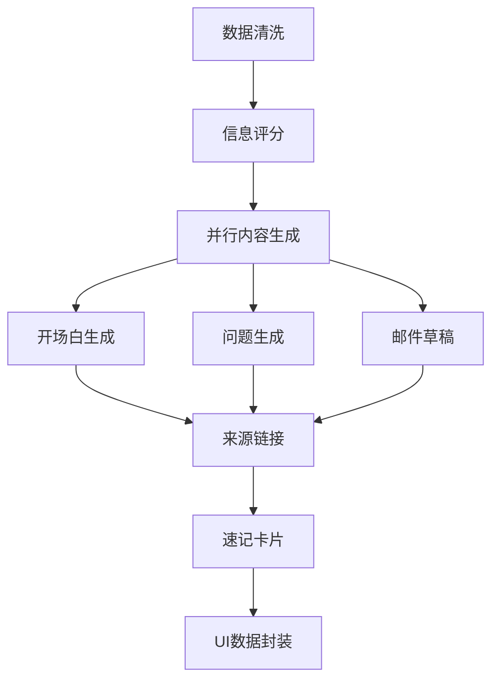
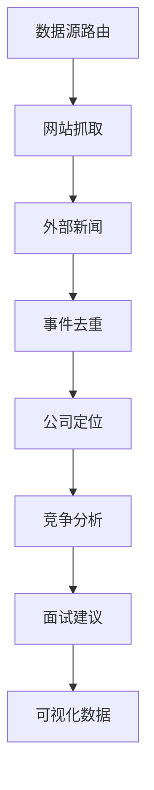

# SmartInsight Career Assistant

一个基于AI的Chrome扩展，专为求职者设计，提供LinkedIn个人资料分析、公司研究和面试准备功能。

## 🎯 核心功能

### LinkedIn个人资料分析
- **智能信息提取**：自动抓取LinkedIn个人资料的关键信息
- **重要性评分**：AI评估信息的相关性和重要程度
- **破冰开场白**：生成个性化的对话开场白
- **深入问题**：提供有针对性的面试或交流问题
- **速记卡片**：快速浏览关键要点和金句

### 公司分析
- **多源信息整合**：官网、新闻、招聘信息综合分析
- **时间线构建**：重要事件和里程碑时间线
- **竞争分析**：识别竞争对手和公司优势
- **面试建议**：基于公司最新动态的面试准备建议
- **技能热力图**：分析公司热门技能需求

### 智能工作流
- **分步渲染**：渐进式显示分析结果，提升用户体验
- **缓存优化**：智能缓存减少重复分析，节省成本
- **成本控制**：实时监控API使用成本
- **多语言支持**：支持中英文内容分析

## 🏗️ 技术架构

### 核心组件
```
Chrome Extension (Manifest V3)
├── Content Script (页面注入)
├── Background Service Worker (后台协调)
├── Popup UI (快速操作界面)
├── Sidebar UI (主要分析界面)
└── Options Page (配置页面)
```

### 数据处理层
```
工作流引擎 (基于DAG)
├── Transform节点 (数据转换)
├── LLM节点 (AI分析)
├── Decision节点 (条件分支)
├── Parallel节点 (并行处理)
└── API Call节点 (外部调用)
```

### 存储层
```
IndexedDB (本地数据库)
├── profiles (个人档案缓存)
├── companies (公司信息缓存)
├── user_settings (用户配置)
├── cost_tracking (成本追踪)
└── workflows (自定义工作流)
```

### AI层
```
AI管理器
├── 请求队列 (优先级调度)
├── 并发控制 (防止限流)
├── 缓存系统 (24小时过期)
├── 成本监控 (实时追踪)
└── 错误重试 (指数退避)
```

## 🚀 快速开始

### 1. 安装依赖
```bash
# 克隆项目
git clone https://github.com/your-repo/smart-insight-chrome-ai.git
cd smart-insight-chrome-ai

# 安装依赖（如果有package.json）
npm install
```

### 2. 配置API密钥
1. 打开Chrome扩展管理页面 (`chrome://extensions/`)
2. 启用"开发者模式"
3. 点击"加载已解压的扩展程序"，选择项目文件夹
4. 右键点击扩展图标 → "选项"
5. 配置API密钥：
   - **Anthropic API Key**: 获取地址 https://console.anthropic.com/
   - **OpenAI API Key** (可选): 获取地址 https://platform.openai.com/api-keys
   - **News API Key** (可选): 获取地址 https://newsapi.org/

### 3. 使用方法

#### LinkedIn个人资料分析
1. 访问任意LinkedIn个人资料页面
2. 点击页面右上角的"分析此人"按钮
3. 等待AI分析完成，查看侧边栏结果

#### 公司分析
1. 访问LinkedIn公司页面或公司官网
2. 点击"分析公司"或"分析网站"按钮
3. 查看公司分析报告和面试建议

#### 手动输入分析
1. 点击扩展图标打开弹窗
2. 选择"闲聊准备"或"公司分析"标签
3. 填写相关信息，点击生成

## ⚙️ 配置选项

### API设置
- **默认模型**: Claude Sonnet (推荐) / Claude Haiku (快速) / GPT-4 (备选)
- **并发请求数**: 1-5个，建议3个
- **缓存开关**: 启用可节省成本和提高速度

### 成本控制
- **每日成本限制**: 默认$10，达到后暂停服务
- **每日请求限制**: 默认1000次
- **实时监控**: 查看今日/本月花费统计

### 数据管理
- **导出数据**: 备份所有分析历史
- **清空缓存**: 删除缓存但保留历史
- **隐私模式**: 不保存任何分析记录

## 📊 工作流详解

### 求职者准备工作流


### 公司分析工作流


## 🔧 开发指南

### 项目结构
```
smart-insight-chrome-ai/
├── manifest.json              # 扩展配置文件
├── background.js              # 后台服务脚本
├── content-script.js          # 内容脚本
├── popup.html/js              # 弹窗界面
├── options.html/js            # 配置页面
├── src/
│   ├── storage/
│   │   └── database.js        # IndexedDB封装
│   ├── scrapers/
│   │   ├── linkedin-scraper.js # LinkedIn采集器
│   │   └── company-scraper.js  # 公司信息采集器
│   ├── workflow/
│   │   ├── workflow-engine.js  # 工作流引擎
│   │   └── predefined-workflows.js # 预定义工作流
│   ├── ai/
│   │   └── ai-manager.js      # AI调用管理器
│   └── ui/
│       └── sidebar.js         # 侧边栏组件
└── images/                    # 图标资源
```

### 添加新的工作流节点
```javascript
// 1. 继承BaseNode类
class CustomNode extends BaseNode {
    async execute(input, context) {
        // 实现节点逻辑
        return processedData;
    }
}

// 2. 注册节点类型
workflowEngine.registerNodeType('custom', CustomNode);

// 3. 在工作流定义中使用
{
    id: 'custom_step',
    type: 'custom',
    config: {
        // 节点配置
    }
}
```

### 自定义AI提示词
```javascript
// 在options页面的"自定义提示词模板"中配置
const customPrompt = `
作为专业的求职顾问，请分析以下信息：
{{input_data}}

请按以下格式输出：
1. 关键亮点
2. 潜在问题
3. 改进建议
`;
```

## 🛡️ 安全与隐私

### 数据安全
- **本地处理**: 所有数据仅在用户浏览器内处理
- **加密存储**: API密钥使用Chrome安全存储
- **无服务器**: 不上传任何数据到第三方服务器

### 隐私保护
- **透明告知**: 明确说明数据使用方式
- **用户控制**: 提供数据清理和隐私模式
- **最小权限**: 仅请求必要的浏览器权限

### 合规性
- **使用限制**: 仅用于个人求职准备
- **频率限制**: 防止对LinkedIn等网站造成负担
- **用户协议**: 明确使用条款和责任

## 🐛 故障排除

### 常见问题

**Q: 扩展无法加载**
A: 检查manifest.json语法，确保所有文件路径正确

**Q: API调用失败**
A: 验证API密钥是否正确，检查网络连接和API配额

**Q: LinkedIn页面无法分析**
A: 确保已登录LinkedIn，某些信息需要登录后才能访问

**Q: 分析结果不准确**
A: 尝试刷新页面重新分析，或在设置中切换AI模型

### 调试模式
1. 在配置页面启用"开发者模式"
2. 打开Chrome开发者工具查看控制台日志
3. 检查Network标签页的API请求状态

### 性能优化
- 启用缓存减少重复请求
- 调整并发请求数避免限流
- 定期清理过期数据释放存储空间

## 📈 版本历史

### v2.0.0 (当前版本)
- 🎉 全新架构重构
- ✨ 工作流引擎支持
- 🚀 智能缓存系统
- 💰 成本监控功能
- 🎨 现代化UI设计

### v1.0.0
- 📝 基础网页总结功能
- 🤖 Chrome内置AI支持
- 🎵 语音播放功能

## 🤝 贡献指南

欢迎提交Issue和Pull Request！

### 开发环境设置
1. Fork项目到你的GitHub账号
2. 克隆到本地开发环境
3. 创建新的功能分支
4. 提交代码并创建Pull Request

### 代码规范
- 使用ES6+语法
- 遵循JSDoc注释规范
- 保持代码简洁和可读性
- 添加适当的错误处理

## 📄 许可证

MIT License - 详见 [LICENSE](LICENSE) 文件

## 🙏 致谢

- [Anthropic](https://anthropic.com/) - Claude AI API
- [OpenAI](https://openai.com/) - GPT API
- [NewsAPI](https://newsapi.org/) - 新闻数据源
- Chrome Extensions团队 - 优秀的扩展平台

---

**⭐ 如果这个项目对你有帮助，请给个Star支持一下！**

有问题或建议？欢迎提交[Issue](https://github.com/your-repo/smart-insight-chrome-ai/issues)或联系开发者。
